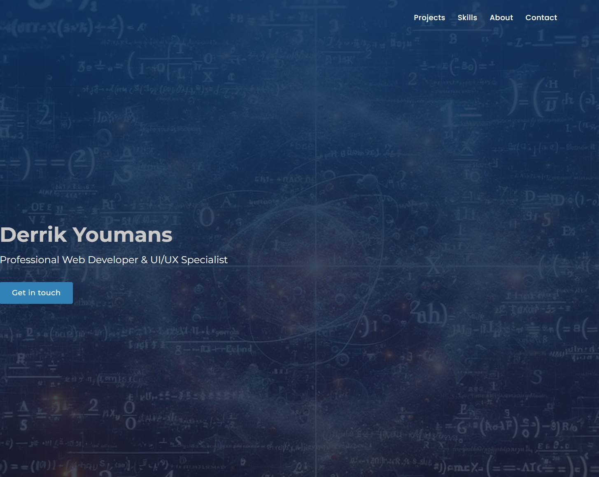

# Derrik Youmans - Software Engineer Portfolio



## 👋 Welcome to My Portfolio

Hello! I'm Derrik Youmans, a Junior Software Engineer based in Orlando, FL. I specialize in full-stack development with JavaScript, Python, and modern web technologies. This portfolio showcases my projects, skills, and journey as a developer.

**[View Live Portfolio](https://dyoumans1.github.io/portfolio/)** 👈 Check out my work!

## 🚀 Featured Projects

### Memoria
A fun and educational memory card game to help users learn Japanese Hiragana characters.
- **Tech Stack**: JavaScript, HTML5, CSS3, DOM Manipulation
- **Features**: Interactive card matching, timer functionality, learning progression
- **[View Live](https://dyoumans1.github.io/memoria-learning-memory-game/)** | **[GitHub Repo](https://github.com/Dyoumans1/memoria-learning-memory-game)**

### CliffJump
A community platform for adventure enthusiasts to discover and share cliff jumping locations.
- **Tech Stack**: JavaScript, Node.js, Express.js, MongoDB, HTML/CSS
- **Features**: User authentication, location sharing, safety ratings, interactive maps
- **[View Live](https://cliffjump-location-app-dc679bf30212.herokuapp.com/)** | **[GitHub Repo](https://github.com/Dyoumans1/cliff-jumping-saltus?tab=readme-ov-file)**

### Barfly
Social platform for bartenders to share cocktail recipes and discover new drinks.
- **Tech Stack**: JavaScript, React, Express.js, MongoDB, HTML/CSS
- **Features**: User profiles, recipe creation, ratings, comments, and discovery features
- **[View Live](https://barfly.netlify.app/)** | **[GitHub Repo](https://github.com/Dyoumans1/bartender-app-collaboration-front-end)**

## 💻 Skills

### Front-End
- JavaScript (ES6+)
- HTML5 & CSS3
- React
- Responsive Design

### Back-End
- Node.js
- Express.js
- RESTful APIs
- Python
- User Authentication

### Database & Tools
- MongoDB
- Git & GitHub
- VS Code
- npm
- Heroku

## 🎓 Education & Certifications

- **Software Engineering Immersive** - General Assembly (2025)
- **Associate's Degree in Computer Science** - Valencia College (In Progress)

## 🔍 About This Portfolio

This portfolio is based on a template that I customized to showcase my projects and skills. I've made modifications to the design, content, and functionality to reflect my personal brand and highlight my work as a developer. While I didn't build the portfolio from scratch, the projects featured within it are my own original work.

### Running Locally

```bash
# Clone this repository
git clone https://github.com/derrikyoumans/portfolio.git

# Navigate to the project
cd portfolio

# Install dependencies
npm install

# Start the development server
npm start
```

## 📬 Let's Connect

I'm always open to new opportunities and collaborations. Feel free to reach out!

- **Email**: derrikyoumans416@gmail.com
- **Phone**: (941) 587-6976
- **[LinkedIn](https://linkedin.com/in/derrikyoumans)**
- **[GitHub](https://github.com/derrikyoumans)**

---

© 2025 Derrik Youmans | Junior Software Engineer
